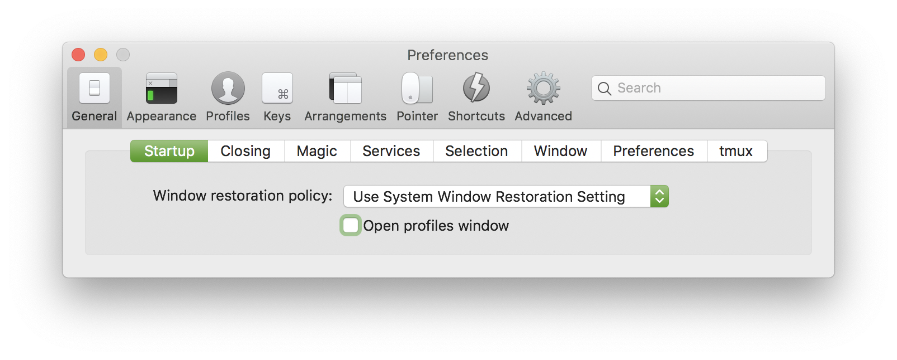
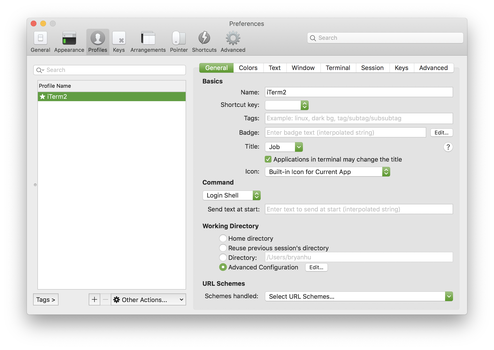
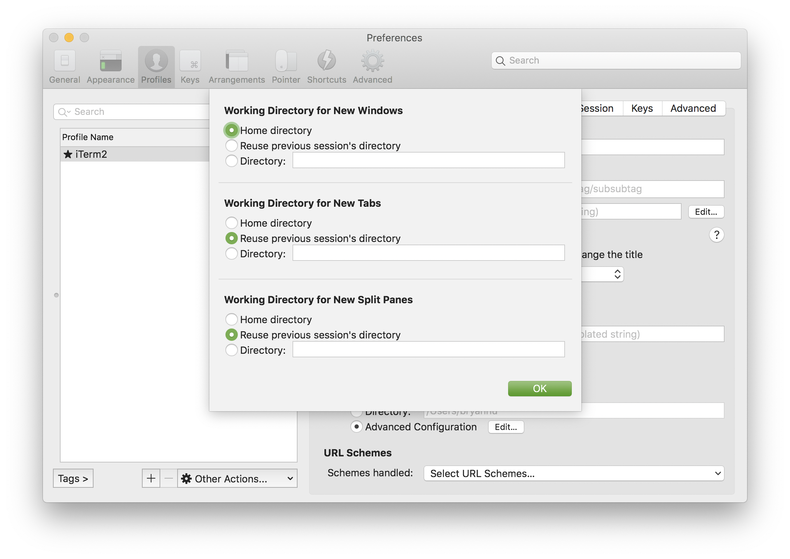
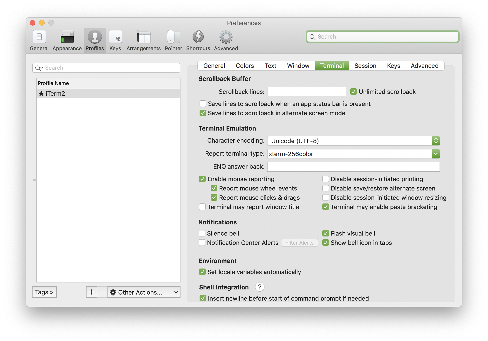
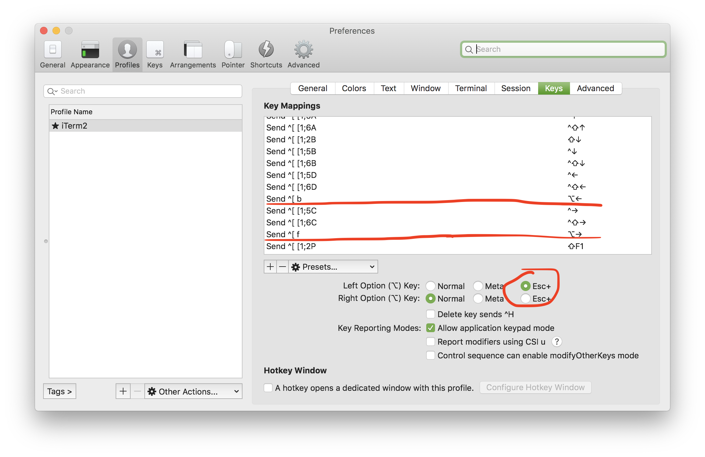

# setup

What I do to set up a new Mac. These are mostly notes for myself.

**NOTE:** Most of these do not require admin privileges

**NOTE:** I need to revamp this with a whole script

~~note to self: maybe upload my `.zshrc`?~~ Check out [my dotfiles](https://github.com/ThatXliner/dotfiles)!

## Terminal and Shell

### iTerm2

1. Download the latest version of iTerm2 [here](https://iterm2.com/downloads.html).
2. Move it to `~/Applications`
3. Configure:

#### Configuration

TODO: iTerm actually lets me export the profile...

* Install [snazzy theme](https://github.com/sindresorhus/iterm2-snazzy) and use it on the default profile
* Set theme to minimal (`Preferences > Appearence > Theme > Minimal`)
* Set `Preferences > General > Startup` to

 * Set `Preferences > Profiles` to look like

and

 * Turn off transparency in `Preferences > Profiles > iTerm2 > Window`
 * Set stuff:


 * You're done I think

## Editors

### Atom

### VSCode

### Vim

## Tools

### Pyenv

```bash
curl -sSf https://pyenv.run | bash
```

Then add the following to your `.zshrc` before the `source $ZSH/oh-my-zsh.sh`

```bash
export PYENV_ROOT="$HOME/.pyenv"
export PATH="$PYENV_ROOT/bin:/Users/bryanhu/.local/bin:$PATH"
eval "$(pyenv init --path)"
```

### Homebrew

```bash
mkdir homebrew && curl -L https://github.com/Homebrew/brew/tarball/master | tar xz --strip 1 -C homebrew
```

I forgot how I got the completions. Maybe add the `brew` plugin to your `.zshrc` (I didn't)?

Remember to add `~/homebrew/bin` to your `$PATH`, though.

### Poetry

### Git

### GPG

#### Admin-less

#### Easiest

### Git, GitHub, and GPG

## Misc

---

Helpful tips if you read this far:

 - [How to open and use apps downloaded from GitHub (or any other source) that is not code signed](https://docs.brew.sh/FAQ#the-app-cant-be-opened-because-it-is-from-an-unidentified-developer)
